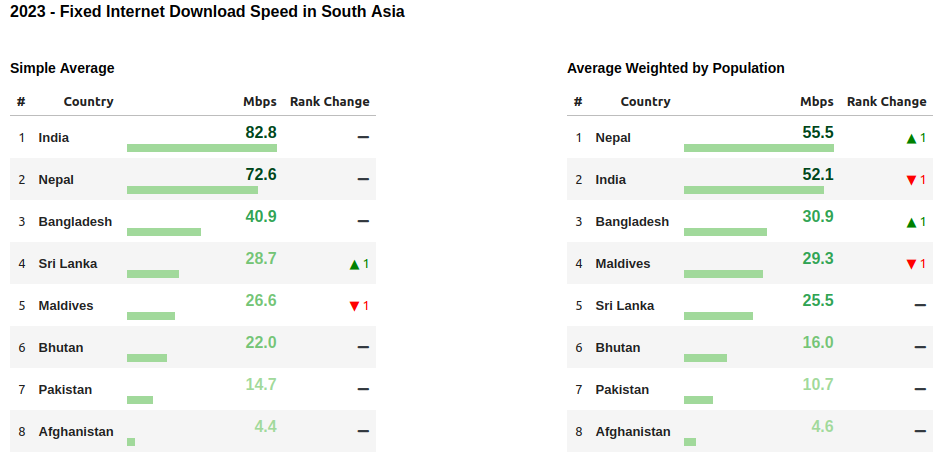
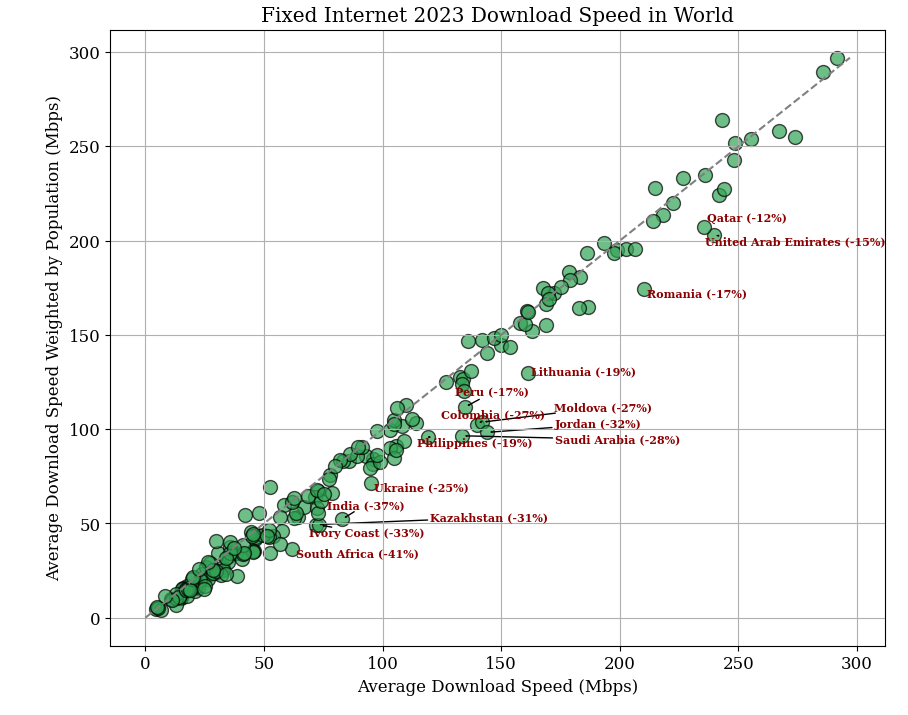
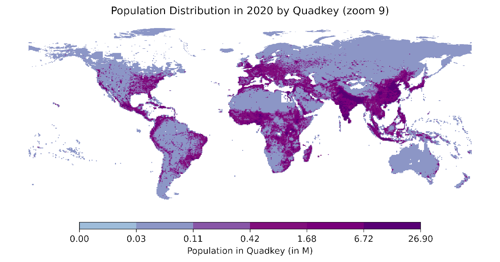

# Pop-Weighted-Internet-Speed

Compare with https://www.speedtest.net/global-index

### Monitoring Tool

The tool, accessible via the notebook `notebooks/internet-speed-notebook.ipynb`, provides an interactive platform for analyzing internet speed data. Users can filter the data by year, internet type (mobile or fixed), and region to generate various visualizations, including tables and maps with an user-friendly interface.




- **Impact of Population Weights**: The incorporation of population weights significantly impacts internet speed calculations. For example, when population weights are applied, the average fixed internet speed in India was found to be 37% lower compared to the unweighted calculation.

  

#### Data Summary:

Aggregated data by country, internet type, and year can be found in `data/internet_speed_summary_by_country.csv`. 

## Methodology

### Data Sources

**Internet Speed Data**: [Speedtest® by Ookla®](https://github.com/teamookla/ookla-open-data) Global Fixed and Mobile Network Performance Maps was accessed from [AWS](https://aws.amazon.com/marketplace/pp/prodview-breawk6ljkovm#resources). It provides internet speed measurements at the tile level, where each tile is identified by a unique `quadkey`, a standard spatial index developed by [Bing Maps](https://learn.microsoft.com/en-us/bingmaps/articles/bing-maps-tile-system). The dataset includes metrics on average download speed, average upload speed, average latency, number of tests, and number of devices. Data is aggregated quarterly, starting from Q1 2019. 

**Population Data**:  Population data at the tile level is obtained from the [WorldPop Project](https://hub.worldpop.org/project/categories?id=3), which provides population estimates for 2020 at a 1 km resolution using unconstrained top-down methods. The raw data is available in GeoTIFF format and can be downloaded from [humdata.org](https://humdata.org). WorldPop does not provide a spatial index for each pixel, so I determine the corresponding `quadkey` for each pixel employing the `pyquadkey2` library.



### Data Aggregation

**Quadkey Aggregation**: The code aggregate population data and internet speed metrics in quadkeys at zoom level 13, corresponding to tiles with a side length of approximately 4,892 meters. In the case of population, aggregation consists in summing the population values from tiles of lower resolution. In the case of internet speed, new average metrics are calculated using the number of tests from tiles of lower resolution as weights. 


**Year Aggregation**: Internet speed metrics are aggregated at the year level using data from multiple quarters. Again, metrics are weighted based on the number of tests conducted within each quarter.

**Country-Level Aggregation**: Internet speed and population data at the tile level is mapped to specific countries using a spatial join with the World Bank’s country boundaries. This step involves translating tile coordinates into geographic points and associating them with corresponding countries. For each year and internet type (mobile or fixed), the data is aggregated by country using population data from each tile as weights.

**Summary of Metrics**

- **Number of Tests**: The total number of tests conducted.
- **Population-Weighted Average Download Speed (Mbps)**: The average download speed  in megabits per second, adjusted on the population size of each tile in the country.
- **Average Download Speed (Mbps)**: The average download speed in megabits per second, weighted by the number of tests in each tile of the country.

## Replication

 This project involves downloading raw data from AWS S3, processing it, and aggregating it for further analysis.

### 1. Project Setup

Before starting, ensure that you have the necessary directories and paths set up. The primary paths used are:

- **Base Path**: `/home/$USER/GitHub/Pop-Weighted-Internet-Speed`
- **Raw Speed Data Folder**: `/media/matias/Elements SE/WB/ookla`

These paths can be customized based on your environment.

### 2. Synchronize Ookla Data

The script `main.sh` handles the synchronization of raw data from AWS S3. It uses the AWS CLI to download data for specified years, quarters, and data types.

#### Sync Data Command

The data is downloaded using the following command:

```bash
aws s3 sync s3://ookla-open-data/${FORMAT}/performance/type=${TYPE}/year=${year}/quarter=${Q}/ ${raw_speed_folder} \
--exact-timestamps \
--no-sign-request
```

Where:

- `FORMAT` is the data format (e.g., `parquet`).
- `TYPE` specifies the data type (`fixed` or `mobile`).
- `year` is the year of the data.
- `Q` denotes the quarter (1 through 4).

### 3. Aggregate Data

Once the data is synchronized, the script `read_and_group_ookla.py` processes and aggregates the raw data. It reads data from the specified folder, performs necessary calculations, and produces aggregated results.

#### Aggregation Steps

1. **Read Data**: The script reads the Parquet files from the `raw_speed_folder`.
2. **Process Data**: It processes the data by computing weighted averages based on the number of tests.
3. **Merge with Population Data**: It merges the aggregated data with population data to provide context.
4. **Export Results**: The final aggregated data is exported as a Parquet file.

### 4. Usage

To execute the script and perform the data synchronization and aggregation, use the following commands

**Run Data Synchronization**

```bash
./main.sh --base_path "/path/to/base" --raw_speed_folder "/path/to/raw_speed" --years "2019,2020,2021" --sync_internet_data 1 --aggregate_data 0

```

**Run Data Aggregation**

```bash
./main.sh --base_path "/path/to/base" --raw_speed_folder "/path/to/raw_speed" --years "2019,2020,2021" --sync_internet_data 0 --aggregate_data 1
```


### 5. Customization

You can customize the script by modifying the `base_path`, `raw_speed_folder`, and `years` parameters. The `sync_internet_data` and `aggregate_data` parameters control whether to perform synchronization or aggregation, respectively.

### 6. Requirements

- **AWS CLI**: Ensure you have the AWS CLI installed and configured.
- **Python**: Ensure you have Python installed with the necessary packages (`pandas`, `pyarrow`, etc.).

## Contact

For questions or feedback, please contact me.

